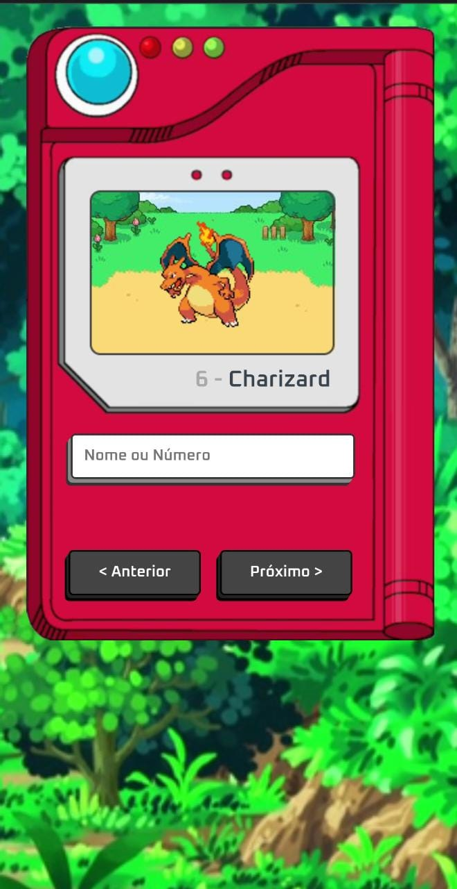

# Pokedex-Simulator

Uma pokedex que traz além dos pokemons e suas evoluções. O projeto foi feito para aprendizado do consumo de uma API e animações usando HTML CSS e JAVASCRIPT

## Tela Inicial Web

## Tela Inicial Mobile

O site está hospedado no gitHub e você pode acessa-lo por este link https://brunnocgama.github.io/Pokedex-Simulator/

## Stack utilizada

**Front-end:** HTML5, Css e Javascript

**Back-end:** Javascript consumo da API hospedada no:https://pokeapi.co/api/v2/
  

**Misc:** Gulp, Babel, ESlint e Conventional Commits

## Aprendizados

- Busquei ter máxima atenção a tags semânticas
- Boas práticas de código
- Fetch e Promises para consumo da API
- Animações de entrada e saida de telas
- ESlint para manter um padrão de código
- Conventional Commits para facilitar a leitura de commits
- Projeto pensado para responsividade evitando excesso de linhas de códigos.

## Como usar
###  Funcionalidades Mobile ou Web!

A pesquisa pode ser feita pelo nome ou se quiser brincar pode digitar um número aleatório, 
aceita letras maiuscula ou minuscula na pesquisa ou as duas ao mesmo tempo.

## NOT FOUND

Caso o pokemon não exista ou aconteça algum erro de digitação uma tela irá avisar sobre.

### Animações

Animações de entrada e saida de tela.

### Projeto em construção
